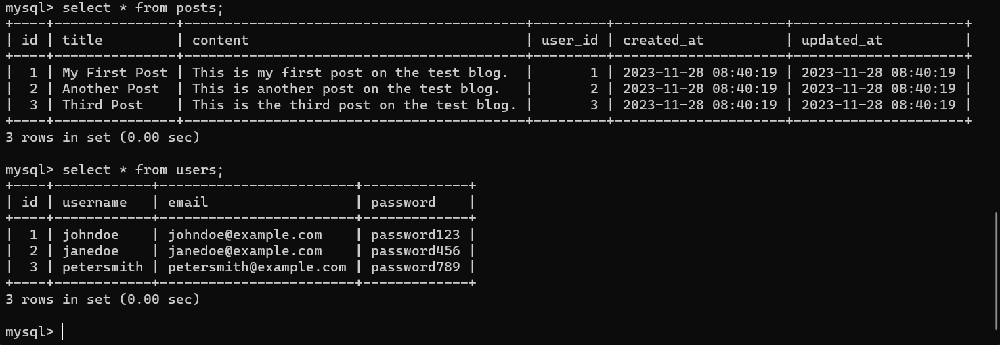
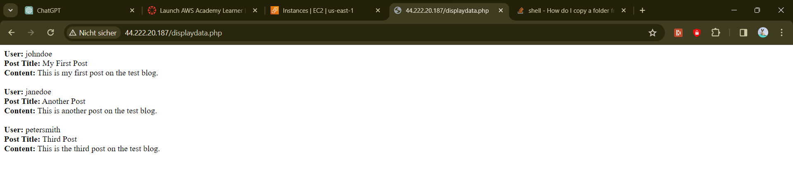

<h1 style="text-align: center;">Dokumentation Backup M143</h1>

<h2 style="text-align: center;"></h2>

<h2 style="text-align: center;">Luca Greuter <br> TBZ <br> 23.01.2024</h2>

## Inhaltsverzeichnis

- [User Story](#user-story)
    - [Userstory](#userstory)
    - [Akzeptanzkriterien](#akzeptanzkriterien)
- [Betriebskonzept](#betriebskonzept)
    - [Konfiguration des Backup-Systems](#konfiguration-des-backup-systems)
    - [Automatisierung und Planung](#automatisierung-und-planung)
    - [Disaster Recovery Plan](#disaster-recovery-plan)
    - [Dokumentation und Schulung](#dokumentation-und-schulung)
    - [Zusätzliche Überlegungen](#zusätzliche-überlegungen)
- [Zweck des Dokuments](#zweck-der-dokumentation)
- [Einführung](#einführung)
    - [Einführung mit Zielsetzung](#einführung-mit-zielsetzung)
    - [Aufbau und Arbeitsweise der konkreten Umgebung](#aufbau-und-arbeitsweise-der-konkreten-umgebung)
- [Organisation](#organisation)
- [Datenschutz](#schweizer-datenschutz)
- [Allgemeine Anforderungen](#allgemeine-anforderungen)
- [Systemdefinition](#systemdefinition)
- [Systemverwaltung](#systemverwaltung)
- [Ausfallsicherheit](#ausfallsicherheit)
  - [Ausfall Web-Server](#ausfall-web-server)
  - [Ausfall SQL-Server](#ausfall-sql-server)
- [Datensicherung](#datensicherung)
- [Wartungsarbeiten](#wartungsarbeiten)
- [Anhang](#anhang)
    - [Netzwerkplan](#netzwerkplan)
    - [Test-Datenbank](#test-datenbank)
    - [Beweis-Datenbank](#beweis-datenbank)
    - [Beweis-Webseite](#beweis-webseite)

***

## User Story

### Titel: Sicheres und effizientes Backup-System für eine Blogging-Webseite

### Userstory:

Als Betreiber einer kleinen Blogging-Webseite möchte ich ein robustes Backup-System implementieren, das es ermöglicht, die Blogs und die zugehörige Webseite zuverlässig zu sichern. Dies ist besonders wichtig, da das Risiko von Datenverlust im Internet immer präsent ist. Ich möchte meinen Nutzern garantieren, dass ihre Inhalte sicher sind und auch bei einem Ausfall der Web- und Datenbankserver nicht verloren gehen.

### Akzeptanzkriterien:

Verwendung des vorhandenen Windows-Servers: Da ich einen ungenutzten Windows-Server besitze, möchte ich diesen effektiv als primären Backup-Server nutzen. Dieser soll so konfiguriert werden, dass er tägliche Backups der Datenbanken durchführt.

Automatisierung und Planung: Das Backup-System soll automatisiert werden, um regelmäßige und konsistente Sicherungen ohne manuellen Aufwand zu gewährleisten. Die Backup-Intervalle sollen an das Datenvolumen und die Aktualisierungshäufigkeit der Webseite angepasst werden.

Disaster Recovery Plan: Es soll ein umfassender Disaster Recovery Plan entwickelt werden, der detailliert beschreibt, wie im Falle eines kompletten Systemausfalls die Wiederherstellung der Webseite und der Blogs erfolgt. Dieser Plan soll regelmäßig getestet und aktualisiert werden.

Dokumentation und Schulung: Die gesamte Backup- und Recovery-Prozedur soll dokumentiert werden. Zusätzlich plane ich, mich in der Benutzung des Backup-Systems zu schulen, um eine schnelle Reaktion im Notfall zu gewährleisten.

***

## Betriebskonzept

### Konfiguration des Backup-Systems
Hardware und Software:
Primärer Backup-Server: Der ungenutzte Windows-Server wird als Haupt-Backup-Server konfiguriert.
Backup-Software: Auswahl und Installation einer Backup-Software, die mit der Webplattform und den Datenbanken kompatibel ist.

Backup-Strategie:
Vollständige und inkrementelle Backups: Kombination aus vollständigen wöchentlichen Backups und täglichen inkrementellen Backups.

Verschlüsselung: 
Implementierung starker Verschlüsselungsmethoden für gesicherte Daten.

### Automatisierung und Planung
Zeitplanung:
Automatische Ausführung der Backups entsprechend festgelegter Zeitpläne, basierend auf dem Datenvolumen und der Aktualisierungsfrequenz der Webseite.

Überwachung und Berichterstattung:
Einrichtung eines Systems zur Überwachung des Backup-Prozesses mit Benachrichtigungen bei Fehlern oder Unregelmäßigkeiten.
Regelmäßige Berichte zur Überprüfung der Backup-Integrität und -Leistung.

### Disaster Recovery Plan
Entwicklung des Plans:
Detaillierte Beschreibung der Schritte zur Wiederherstellung der Webseite und der Blogs im Falle eines kompletten Systemausfalls.
Festlegung von Prioritäten und Verantwortlichkeiten im Wiederherstellungsprozess.

Regelmäßige Tests und Aktualisierungen:
Durchführung regelmäßiger Tests des Recovery-Plans, um dessen Effektivität sicherzustellen.
Aktualisierung des Plans in Übereinstimmung mit Änderungen in der IT-Infrastruktur oder Betriebsprozessen.

### Dokumentation und Schulung
Dokumentation:
Erstellung einer detaillierten Dokumentation des Backup- und Recovery-Prozesses.
Zugängliche Aufbewahrung der Dokumentation für den Auftraggeber.

Schulung:
Schulung des Auftraggebers in der Benutzung und Überwachung des Backup-Systems.
Regelmäßige Auffrischungskurse und Updates bei neuen Systemänderungen oder -updates.

### Zusätzliche Überlegungen
Datensicherheit und Compliance:
Überprüfung der Backup- und Recovery-Verfahren auf Einhaltung von Datenschutzbestimmungen.

Skalierbarkeit und Flexibilität:
Planung für zukünftiges Wachstum und erhöhte Datenmengen.
Flexibilität zur Anpassung der Backup-Strategie an neue Technologien und Anforderungen.

***

## Zweck der Dokumentation
Dieses Dokument dient dazu, dem Auftraggeber die genauen Abläufe und Überlegungen während der Umsetzung des Projekts zu verdeutlichen. Damit im Falle von Fragen oder Dingen, die auf den ersten Blick nicht verständlich sind, diese Schritte nachvollziehbar gemacht werden können. Der Auftraggeber wünscht sich einen detaillierten Einblick in die einzelnen Schritte der Backup-Prozedur, damit er diese selbstständig umsetzen kann und keine Hilfe von Externen beantragen möchte. Obwohl wir im Vertrag festgelegt haben, bieten wir dem Auftraggeber 2 Jahre kostenlosen Support im Falle von Problemen oder Fragen. Aber auch falls ähnliche zukünftige Probleme oder Projekte auftreten, diese schneller zu lösen.

## Einführung

### Einführung mit Zielsetzung
Mit dieser Dokumentation will man den ganzen Ablauf der Umsetzung offen legen, aber auch soll es als Anleitung dienen, um dem Besitzer der Webseite die Möglichkeit zu offerieren, das Backup und Restore der beiden Server selbstständig durchzuführen. Gerichtet ist diese Dokumentation an alle Betreiber der Blogging-Webseite, aber auch dem Team, welches das Projekt umgesetzt hat, um im Falle von Fragen dem Auftraggeber helfen zu können.

### Aufbau und Arbeitsweise der konkreten Umgebung

Das Backup wird auf einem kleinen Server verwaltet und gespeichert. Dieser Server wurde vom Auftraggeber zur Verfügung gestellt, um Budget zu sparen.

Der Auftraggeber möchte das Backup selbst verwalten und bei kleineren Problemen eigenständig Lösungen finden. Deshalb haben wir uns für eine Windows-Umgebung für den Backup-Server entschieden, anstatt Linux zu verwenden.

Der Server ist mit einem 4-Core-Prozessor und 8 GB RAM ausgestattet. Für die Speicherung der Backups und Skripte haben wir eine 200 GB SATA SSD gewählt. Diese SSD lässt sich schnell entfernen und wieder hinzufügen, falls der Server ausgetauscht oder verbessert werden muss.

Auf dem Windows Server haben wir zwei Ordner eingerichtet. Einer wird für die Verwaltung der Skripte genutzt, der andere für die Speicherung der Backups.

Der SQL-Server basiert auf Ubuntu, Linux und wird zusammen mit dem Web-Server in einer AWS-Umgebung betrieben. Auf dem SQL-Server ist ein Standard-MySQL installiert. Es wurde auch ein Backup-Benutzer ohne Passwort erstellt, der nur Backups der Datenbank erstellen kann.

Für Änderungen kann der root User verwendet werden, aber das ist nicht zu empfehlen. Stattdessen haben wir einen Admin-User eingerichtet. Zusätzlich wurde ein MySQL-User hinzugefügt, der von einer anderen IP-Adresse auf die Datenbank zugreifen kann, wie beispielsweise der Web-Server.

Der Web-Server nutzt Apache2 und PHP, die beim Aufsetzen in AWS mit einem YAML installiert und konfiguriert werden. Alle Verbindungen, einschließlich des Ausführens des PHP-Skripts zum Anzeigen der Daten vom SQL-Server und das Erstellen der Backups, erfolgen über SSH. Die Backups werden mittels SCP auf den Backup-Server kopiert.

Die Backups werden mit dem Task-Scheduler auf dem Backup-Server ausgelöst. Für zusätzliche Sicherheit im Notfall wird eine externe Festplatte am Backup-Server angeschlossen, auf der sich immer die neuesten Backups befinden. Zudem gibt es ein komplettes Backup des Backup-Servers auf einem weiteren externen Speichermedium, sodass dieser im Notfall direkt ersetzt werden kann.

<h2 style="text-align: center;"></h2>

## Organisation

<h2 style="text-align: center;"></h2>

Die verantwortliche Organisation ist ein kleines Unternehmen namens "MyBlogging", welches den Benutzern eine kostenlose Oberfläche bieten will, den Leuten die Möglichkeit zu geben, Blogs zu schreiben und lesen, wo/wann/wie sie wollen. Die kleine Seite wird von drei Personen als Nebenjob betrieben, mit dem Hintergrund "Wir waren schon immer Fans von Blogs und diese Freude wollen wir mit allen Teilen". Die drei Personen teilen ihre Verantwortungen immer auf und wechseln sich immer wieder ab. Wenn jemand nicht vorige Zeit hat, übernehmen die anderen Beiden, aber die rechtliche Verantwortung trägt der Gründer und der eingetragene Besitzer des kleinen Unternehmens. Alle drei machen hauptberuflich einen anderen Job und waren drei Freunde welche sich mal zusammen getan haben, um dieses Unternehmen zu gründen, alle drei sind Lehrer, einer von ihnen hatte sich mal für Web Development interessiert und ist mit der Idee der Webseite gekommen, da sie aber nicht grosse Erfahrung mit Informatik haben wollte sie das Umsetzen des Backups Profis überlassen. Das kleine Unternehmen ist lokalisiert in Uster an der Musterstrasse 22. 

## Schweizer Datenschutz

Einhaltung des Schweizer Datenschutzgesetzes (DSG) im Backup-Konzept
Um die Konformität mit dem Schweizer Datenschutzgesetz (DSG) sicherzustellen, haben wir spezifische Maßnahmen in unser Backup-System integriert. Diese Maßnahmen stellen sicher, dass sowohl die Verarbeitung als auch die Sicherung personenbezogener Daten den gesetzlichen Anforderungen entsprechen.

Datensicherheit gemäß DSG Art. 7: Unser Backup-System verwendet fortschrittliche Verschlüsselungstechnologien, um die Sicherheit der Daten während der Übertragung und Speicherung zu gewährleisten. Sowohl die Übertragung der Daten von unserem AWS-basierten SQL-Server zum Backup-Server als auch die Speicherung auf der 200 GB SATA SSD erfolgen unter Verwendung starker Verschlüsselungsprotokolle. Zudem führen wir regelmäßig Sicherheitsaudits durch, um die Integrität des Systems zu gewährleisten und potenzielle Schwachstellen zu identifizieren.

Rechte der betroffenen Personen (DSG Art. 15 - 21): Unser System ermöglicht es, Anfragen der betroffenen Personen in Bezug auf ihre personenbezogenen Daten effizient zu bearbeiten. Dies umfasst Auskunftsrechte, sowie Anfragen zur Berichtigung oder Löschung von Daten. Unser Backup-System ist so konzipiert, dass es eine schnelle Identifizierung und Bearbeitung solcher Anfragen ermöglicht.

Sicherer Datentransfer (DSG Art. 6): Die Übertragung der Daten zwischen dem AWS-basierten SQL-Server und dem Backup-Server erfolgt sicher über SSH und SCP. Diese Protokolle gewährleisten eine hohe Sicherheit bei der Datenübermittlung und sind konform mit den Anforderungen des DSG.

Dokumentation und Transparenz: Wir führen detaillierte Aufzeichnungen aller Backup-Prozesse und verwendeten Sicherheitsmaßnahmen. Dies umfasst ein Verzeichnis der Verarbeitungstätigkeiten, das regelmäßig aktualisiert wird, um die vollständige Transparenz und Nachverfolgbarkeit zu gewährleisten.

Notfallplanung und Datenwiederherstellung (DSG Art. 7): Im Falle eines Datenverlusts ermöglicht unser System eine schnelle und effiziente Wiederherstellung der Daten aus den Backups. Wir haben einen umfassenden Disaster Recovery Plan entwickelt, der detailliert beschreibt, wie Daten im Notfall wiederhergestellt werden können, um Ausfallzeiten zu minimieren und die Kontinuität der Datenverfügbarkeit zu gewährleisten.

Durch die Integration dieser spezifischen Maßnahmen in unser Backup-System stellen wir sicher, dass wir den Anforderungen des Schweizer Datenschutzgesetzes in vollem Umfang gerecht werden und gleichzeitig ein robustes und sicheres Backup-System bereitstellen.

## Allgemeine Anforderungen

Der Server benötigt eine stabile Internetverbindung, um Backups von AWS abzurufen. Es ist auch wichtig, dass der Backup-Server kontinuierlich, also 24/7, laufen kann.

Es müssen ausreichend finanzielle Mittel vorhanden sein, um die Server auf AWS zu hosten. Die Kosten dafür liegen bei etwa 990 USD pro Jahr.

Es wird empfohlen, mit der Möglichkeit zu rechnen, mehrere Webserver zu hosten. Dies ist besonders wichtig, falls die Webseite einen sehr hohen Nutzerandrang erfährt. Die Performance kann je nach Standort der Nutzer variieren.

Für den Webserver ist eine Mindestkonfiguration von 16 GB RAM und 4 Cores erforderlich. Mehr Leistung ist nicht nötig, da der Rest der Aufgaben über das PHP-Script vom SQL-Server übernommen wird.

Der SQL-Server benötigt im Vergleich eine höhere Rechenleistung, insbesondere bei den CPU-Cores, da SQL von vielen und schnellen Cores profitiert. Schnelle Speichermedien sind ebenfalls wichtig, besonders bei häufigen Änderungen in der Datenbank.

Für den Backup-Server sind die Anforderungen geringer. Er muss lediglich Skripte ausführen und Daten speichern, hier reichen 8 GB RAM und 4 Cores aus.

Bei der Softwarewahl setzen wir beim Web- und SQL-Server auf ein Linux-basiertes Betriebssystem, da hier hauptsächlich Skripte ausgeführt werden und keine Benutzeroberfläche nötig ist. Linux benötigt weniger Leistung, was zu Einsparungen bei der Hardware führt und somit geringere Kosten.

Für den Backup-Server wurde Windows gewählt, da es für die Mitarbeiter des Unternehmens einfacher zu bedienen ist. Der Server wurde bereits mit Windows vorinstalliert geliefert, benötigte nur ein Update und eine leichte Konfiguration, um Kosten und Mühen zu sparen.

Bei der Software des Backup-Servers muss nicht viel beachtet werden. Da die Backup-Skripte sowohl auf den Linux-Instanzen auf AWS als auch auf dem Windows-Backup-Server laufen, verwenden wir Shell-Skripte. Diese sind einfacher auf Windows auszuführen als umgekehrt Windows PowerShell auf Linux-Maschinen.

PowerShell kann zwar auf Linux-Maschinen installiert werden, würde aber mit den geplanten Backup-Skripten nicht funktionieren, falls diese in PowerShell geschrieben sind. Daher ist es notwendig, Cygwin auf dem Windows-Gerät zu installieren. Cygwin ermöglicht es, Linux- und Unix-Programme auf Windows zu portieren und ist nützlich, um Shell-Skripte auf Windows auszuführen.

Eine alternative Methode, um Shell und Bash auf Windows laufen zu lassen, ist WSL. Aber Cygwin ist eine einfachere Lösung, da für WSL das gesamte Subsystem installiert werden muss.

## Systemdefinition

| Systeme         | Backup-Server       | Web-Server    | SQL-Server    |
|-----------------|---------------------|---------------|---------------|
| CPU-Core        | 4                   | 4             | 16            |
| RAM             | 8 GB                | 16 GB         | 16 GB         |
| Storage         | 200 GB              | 20 GB         | 120 GB        |
| Einsatzzweck    | Scripts und Backups | Webserver     | Datenbank     |
| Betriebssystem  | Windows Server 2022 | Ubuntu Server | Ubuntu Server |

## Systemverwaltung

Der Zugang zu den Systemen erfolgt einfach und unkompliziert über einen SSH-Key. Dieser wird sowohl für den Zugriff auf den Backup-Server als auch auf die beiden in der AWS Cloud laufenden Server verwendet.

Es gibt drei unterschiedliche private SSH-Keys: Einer ermöglicht den Zugriff von den Systemen auf den Backup-Server. Zusätzlich besitzt jeder Beteiligte zwei weitere private Keys, einen für den Zugriff auf den Web-Server und einen für den SQL-Server.

Der Backup-Server benötigt ebenfalls Zugriff auf den SQL-Server, um Backups zu erstellen oder Datenbank-Dumps der für die Webseite relevanten Daten zu generieren. Für den Backup-Server wurde ein spezieller privater Key bereitgestellt.

Bei Systemaktualisierungen des Backup-Servers erhalten die Verantwortlichen Benachrichtigungen über verfügbare Windows-Updates. Diese Updates werden in der Regel sofort durchgeführt, es sei denn, es läuft gerade ein Backup oder ein solches steht kurz bevor.

Bei den AWS-Instanzen wird das Update-Verfahren anders gehandhabt. Hier wird ein fester Termin für Updates festgelegt, in diesem Fall sonntags zwischen 22:00 und 24:00 Uhr. Dies gibt genügend Zeit, Updates durchzuführen und eventuelle Probleme am darauffolgenden Arbeitstag zu lösen.

Die Wahl dieses Zeitfensters für Updates basiert auf der Annahme, dass Menschen während der Arbeitszeit weniger wahrscheinlich Blogs schreiben oder lesen. Am Wochenende ist die Wahrscheinlichkeit höher, da Menschen in ihrer Freizeit eher dazu neigen, Blogs zu schreiben.

## Ausfallsicherheit

Beim Ausfall des Backup-Servers sofort die abnehmbare Festplatte entfernen und die Verantwortlichen, welche für die Konfiguration des Backup-Servers zuständig waren, informieren. Falls der Backup-Server nicht mehr zum Laufen gebracht werden kann, soll so schnell wie möglich ein zweiter Backup-Server angeschafft werden. Falls ein neuer Server angeschafft wurde, kann dieser mit dem Backup von der einen externen Festplatte restauriert und schnell wieder in Betrieb genommen werden. Man könnte auch den Backup-Services direkt von AWS benutzen, doch dieser kostet im Vergleich zu unserer Lösung ungefähr 0.15USD pro GB, das sieht nicht nach viel aus, doch mit der Zeit und wenn die Blogging-Webseite sehr gross wird, wird es eher kostspielig. Anders sieht das aus bei den beiden AWS-Instanzen. 

### Ausfall Web-Server

Vom Web-Server wird kein Backup erstellt, denn dieser nimmt die Daten von der Datenbank und hat selber nicht ausser dieses Script auf sich. Beim Ausfall oder Überlastung muss sofort auf AWS eine zweite EC2-Instanz mit den genauen Spezifikationen erstellt werden, damit aber alles schon vor installiert ist, kann man mit einem einfachen Yaml die Instanz schon vorkonfigurieren.

```yaml
#cloud-config
users:
  - name: ubuntu
    sudo: ALL=(ALL) NOPASSWD:ALL
    groups: users, admin
    home: /home/ubuntu
    shell: /bin/bash
    ssh_pwauth: false
    ssh_authorized_keys:
      - ssh-rsa AAAAB3NzaC1yc2EAAAADAQABAAAAgQCSSoUukq3sMUjh/bkne/+XvbXSnKjTM3lhreNIBuSY7jH/EJx3/gWOPamL5ZC9qqV+PuWCvajhiJAZ7HcdyYEVMkSxgXbHH+S40fnITPfb6RBBc0Ej2aWylc6d4eRK4Bz7Gg1U7EAGnyP8K+9rNy3o4r8VD8cwICsmmUqYWe0yDw== aws-key
disable_root: false
package_update: true
packages:
  - curl
  - wget
  - apache2
  - php
  - libapache2-mod-php
  - php-mysqli
  - adminer
runcmd:
  - sudo systemctl restart apache2
  - sudo a2enconf adminer
  - sudo systemctl restart apache2
```

Zudem muss man beachten, dass wenn man den alten Web-Server ersetzt, muss man in AWS die Elastic-IP-Adress der alten Instanz entziehen und der neuen zuordnen. Anders ist das, wenn man einen weiteren Web-Server benötigt, weil um auf die SQL-Datenbank zuzugreifen, muss man den Web-Server als User in der Datenbank registrieren und dafür muss man mit einem SQL-Command auf dem SQL-Server die IP des neuen Web-Servers angeben.

```sql
CREATE USER 'WebUser'@'44.222.20.187' IDENTIFIED BY 'WebUser1234';
GRANT ALL PRIVILEGES ON test_db.* TO 'WebUser'@'44.222.20.187';
FLUSH PRIVILEGES;
```

### Ausfall SQL-Server

Bei einem Ausfall der SQL-Datenbank muss man zuerst wieder die IP-Adresse des alten Servers entziehen und dann eine neue Instanz mit der gleichen Spezifikation erstellen, auch hier können wir uns Arbeit ersparen, indem wir mit einem Yaml die ganze vor Installation wieder erledigen.

```yaml
#cloud-config 
users:   
  - name: ubuntu     
    sudo: ALL=(ALL) NOPASSWD:ALL     
    groups: users, admin     
    home: /home/ubuntu     
    shell: /bin/bash     
    ssh_pwauth: false 
    ssh_authorized_keys:       
      - ssh-rsa AAAAB3NzaC1yc2EAAAADAQABAAAAgQCSSoUukq3sMUjh/bkne/+XvbXSnKjTM3lhreNIBuSY7jH/EJx3/gWOPamL5ZC9qqV+PuWCvajhiJAZ7HcdyYEVMkSxgXbHH+S40fnITPfb6RBBc0Ej2aWylc6d4eRK4Bz7Gg1U7EAGnyP8K+9rNy3o4r8VD8cwICsmmUqYWe0yDw== aws-key
disable_root: false 
package_update: true 
packages:
  - curl   
  - wget
  - mysql-server

runcmd:
  - systemctl start mysql
  - systemctl enable mysql
```

Aber um die installation zu vervollständigen, muss man diese Konfiguration noch abschliessen.

```bash
sudo mysql_secure_installation
```

Wenn all diese Schritte so befolgt wurden, muss man nur den Restore der Datenbank wieder ausführen, dafür Kopieren wir mit Hilfe von SCP den neusten SQL-Dump auf die AWS-Instanz und dort können wir dann mit diesen Befehlen die Datenbank wiederherstellen.

```bash
mysql> create database test_db;

mysql -u [user_name] –p [test_db] < [backup_file.sql]
```

## Datensicherung

Die Art in welcher die Daten gesichert werden ist einfach. Jeden Tag um 00:00 wird vom Backup-Server ein SQL-dump Script auf dem SQL-Server getriggert und dieses wird dann auch mit dem gleichen Script via SCP vom SQL-Server auf den Backup-Server gespeichert.

```bash
#!/bin/bash

# Linux server SSH connection details
linux_user='ubuntu'
linux_host='34.233.245.79'
linux_key='C:\Users\lucag\Desktop\sql_rsa'
linux_script='/home/ubuntu/backup_script.sh'

# Windows server backup directory
backup_dir='C:\Users\lucag\Desktop\Backup'

# Generate timestamp on the Windows machine
timestamp=$(/bin/date +"%Y-%m-%d_%H-%M")

# Establish SSH connection to the Linux server and execute the backup script
ssh -i "$linux_key" "$linux_user@$linux_host" "bash $linux_script"

# Copy the backup file from Linux to Windows
cd '/cygdrive/c/Users/lucag/Desktop/Backup'
scp -i .././sql_rsa ubuntu@34.233.245.79:/home/ubuntu/backup_file.sql ./Backup_SQL/backup_file_$timestamp.sql

```

In diesem Script wird genau gezeigt mit der Verbindung zum SQL-Server, auf diesem wird dann das 'backup_script.sh' ausgeführt. 

```bash
mysqldump -u BackupUser test_db > backup_file.sql
```

Dieses Script macht einen aktuellen SQL-Dump der Datenbank und ersetzt damit das vorherige, denn der vorherige Dump ist auf dem Backup-Server gespeichert. Im SQL-Dump sind alle Daten vorhanden von den Leuten, welche die Blogs posten, also Namen, E-Mail, Geburtstag und evtl. auch noch Nationalität und Geschlecht, ebenso den Blog an sich. Aber laut dem Schweizer Datenschutzgesetz müssen Datensicherungen wie diese für 10 Jahre aufbewahrt werden. Im Moment wird die Datensicherung täglich ausgeführt, doch bei einer Blogging-Webseite, welche die ganze Zeit neue Blogs hinzukommen, wäre es sinnvoll mehrere Backups täglich auszuführen oder auch einen Dienst zu erstellen, welcher bei jedem Hinzufügen eines Blogs das Backup triggert.

## Wartungsarbeiten

Dieses Script macht einen aktuellen SQL-Dump der Datenbank und ersetzt damit das vorherige, denn der vorherige Dump ist auf dem Backup-Server gespeichert. Im SQL-Dump sind alle Daten vorhanden von den Leuten, welche die Blogs posten, also Namen, E-Mail, Geburtstag und evtl. auch noch Nationalität und Geschlecht, ebenso den Blog an sich. Aber laut dem Schweizer Datenschutzgesetz müssen Datensicherungen wie diese für 10 Jahre aufbewahrt werden. Im Moment wird die Datensicherung täglich ausgeführt, doch bei einer Blogging-Webseite, welche die ganze Zeit neue Blogs hinzukommt, wäre es sinnvoll, mehrere Backups täglich auszuführen oder auch einen Dienst zu erstellen, welcher bei jedem Hinzufügen eines Blogs das Backup triggert.

## Anhang

### Netzwerkplan
<h2 style="text-align: center;"></h2>

### Test-Datenbank

```sql
CREATE DATABASE test_db;
 
USE test_db;
 
CREATE TABLE users (
  id INT PRIMARY KEY AUTO_INCREMENT,
  username VARCHAR(255) UNIQUE NOT NULL,
  email VARCHAR(255) UNIQUE NOT NULL,
  password VARCHAR(255) NOT NULL
);
 
INSERT INTO users (username, email, password)
VALUES
  ('johndoe', 'johndoe@example.com', 'password123'),
  ('janedoe', 'janedoe@example.com', 'password456'),
  ('petersmith', 'petersmith@example.com', 'password789');
 
CREATE TABLE posts (
  id INT PRIMARY KEY AUTO_INCREMENT,
  title VARCHAR(255) NOT NULL,
  content TEXT NOT NULL,
  user_id INT NOT NULL,
  created_at DATETIME NOT NULL DEFAULT CURRENT_TIMESTAMP,
  updated_at DATETIME NOT NULL DEFAULT CURRENT_TIMESTAMP ON UPDATE CURRENT_TIMESTAMP,
  FOREIGN KEY (user_id) REFERENCES users(id)
);
 
INSERT INTO posts (title, content, user_id)
VALUES
  ('My First Post', 'This is my first post on the test blog.', 1),
  ('Another Post', 'This is another post on the test blog.', 2),
  ('Third Post', 'This is the third post on the test blog.', 3);
```
<sub>Test-Datenbank wurde von ChatGPT erstellt<sub>

### Beweis-Datenbank



### Beweis-Webseite



### SQL-Dump

```sql
-- MySQL dump 10.13  Distrib 8.0.35, for Linux (x86_64)
--
-- Host: localhost    Database: test_db
-- ------------------------------------------------------
-- Server version	8.0.35-0ubuntu0.22.04.1

/*!40101 SET @OLD_CHARACTER_SET_CLIENT=@@CHARACTER_SET_CLIENT */;
/*!40101 SET @OLD_CHARACTER_SET_RESULTS=@@CHARACTER_SET_RESULTS */;
/*!40101 SET @OLD_COLLATION_CONNECTION=@@COLLATION_CONNECTION */;
/*!50503 SET NAMES utf8mb4 */;
/*!40103 SET @OLD_TIME_ZONE=@@TIME_ZONE */;
/*!40103 SET TIME_ZONE='+00:00' */;
/*!40014 SET @OLD_UNIQUE_CHECKS=@@UNIQUE_CHECKS, UNIQUE_CHECKS=0 */;
/*!40014 SET @OLD_FOREIGN_KEY_CHECKS=@@FOREIGN_KEY_CHECKS, FOREIGN_KEY_CHECKS=0 */;
/*!40101 SET @OLD_SQL_MODE=@@SQL_MODE, SQL_MODE='NO_AUTO_VALUE_ON_ZERO' */;
/*!40111 SET @OLD_SQL_NOTES=@@SQL_NOTES, SQL_NOTES=0 */;

--
-- Table structure for table `posts`
--

DROP TABLE IF EXISTS `posts`;
/*!40101 SET @saved_cs_client     = @@character_set_client */;
/*!50503 SET character_set_client = utf8mb4 */;
CREATE TABLE `posts` (
  `id` int NOT NULL AUTO_INCREMENT,
  `title` varchar(255) NOT NULL,
  `content` text NOT NULL,
  `user_id` int NOT NULL,
  `created_at` datetime NOT NULL DEFAULT CURRENT_TIMESTAMP,
  `updated_at` datetime NOT NULL DEFAULT CURRENT_TIMESTAMP ON UPDATE CURRENT_TIMESTAMP,
  PRIMARY KEY (`id`),
  KEY `user_id` (`user_id`),
  CONSTRAINT `posts_ibfk_1` FOREIGN KEY (`user_id`) REFERENCES `users` (`id`)
) ENGINE=InnoDB AUTO_INCREMENT=4 DEFAULT CHARSET=utf8mb4 COLLATE=utf8mb4_0900_ai_ci;
/*!40101 SET character_set_client = @saved_cs_client */;

--
-- Dumping data for table `posts`
--

LOCK TABLES `posts` WRITE;
/*!40000 ALTER TABLE `posts` DISABLE KEYS */;
INSERT INTO `posts` VALUES (1,'My First Post','This is my first post on the test blog.',1,'2024-01-09 08:14:15','2024-01-09 08:14:15'),(2,'Another Post','This is another post on the test blog.',2,'2024-01-09 08:14:15','2024-01-09 08:14:15'),(3,'Third Post','This is the third post on the test blog.',3,'2024-01-09 08:14:15','2024-01-09 08:14:15');
/*!40000 ALTER TABLE `posts` ENABLE KEYS */;
UNLOCK TABLES;

--
-- Table structure for table `users`
--

DROP TABLE IF EXISTS `users`;
/*!40101 SET @saved_cs_client     = @@character_set_client */;
/*!50503 SET character_set_client = utf8mb4 */;
CREATE TABLE `users` (
  `id` int NOT NULL AUTO_INCREMENT,
  `username` varchar(255) NOT NULL,
  `email` varchar(255) NOT NULL,
  `password` varchar(255) NOT NULL,
  PRIMARY KEY (`id`),
  UNIQUE KEY `username` (`username`),
  UNIQUE KEY `email` (`email`)
) ENGINE=InnoDB AUTO_INCREMENT=4 DEFAULT CHARSET=utf8mb4 COLLATE=utf8mb4_0900_ai_ci;
/*!40101 SET character_set_client = @saved_cs_client */;

--
-- Dumping data for table `users`
--

LOCK TABLES `users` WRITE;
/*!40000 ALTER TABLE `users` DISABLE KEYS */;
INSERT INTO `users` VALUES (1,'johndoe','johndoe@example.com','password123'),(2,'janedoe','janedoe@example.com','password456'),(3,'petersmith','petersmith@example.com','password789');
/*!40000 ALTER TABLE `users` ENABLE KEYS */;
UNLOCK TABLES;
/*!40103 SET TIME_ZONE=@OLD_TIME_ZONE */;

/*!40101 SET SQL_MODE=@OLD_SQL_MODE */;
/*!40014 SET FOREIGN_KEY_CHECKS=@OLD_FOREIGN_KEY_CHECKS */;
/*!40014 SET UNIQUE_CHECKS=@OLD_UNIQUE_CHECKS */;
/*!40101 SET CHARACTER_SET_CLIENT=@OLD_CHARACTER_SET_CLIENT */;
/*!40101 SET CHARACTER_SET_RESULTS=@OLD_CHARACTER_SET_RESULTS */;
/*!40101 SET COLLATION_CONNECTION=@OLD_COLLATION_CONNECTION */;
/*!40111 SET SQL_NOTES=@OLD_SQL_NOTES */;

-- Dump completed on 2024-01-09 11:50:02

```


<sup>Die Datenbank und Webseite wurde nur für Test-Zwecke benutzt, in der ganzen Dokumentation wird über die definitive Umsetzung des Auftrags geschrieben.<sup>

<sub style="text-align: center; color: blue;"> Kuba's IT Realisierung<sub>